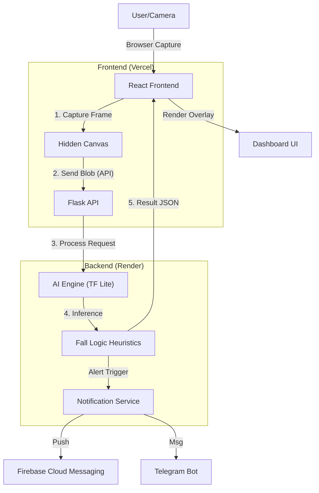

# 🛡️ GuardianAI: Real-Time Fall Detection System


---

## 📖 Executive Summary
**GuardianAI** is a privacy-focused, edge-computing solution designed to protect the elderly living alone. By leveraging **Computer Vision (PoseNet)** and **Async Architecture**, it transforms any standard laptop or webcam into a 24/7 intelligent safeguard.

Unlike wearable devices that need charging or can be forgotten, GuardianAI monitors the environment passively and triggers immediate alerts (SMS/Push/Email) when a critical fall event is detected, potentially saving lives by reducing response time.

---

## 🏗️ System Architecture

GuardianAI utilizes a **Hybrid Cloud/Edge Architecture**. The video capture happens on the user's device (Frontend), ensuring zero-latency feedback, while the heavy AI processing is offloaded to a dedicated backend API.



### Key Technical Innovations
1.  **Frontend-First Capture**: Utilizes `navigator.mediaDevices` to access the camera directly in the browser, eliminating backend hardware dependencies and enabling cloud deployment.
2.  **Request Locking Mechanism**: Implements a smart locking system in the frontend to prevent network congestion by ensuring frames are processed sequentially.
3.  **Privacy-First Design**: Video feeds are processed in real-time and not stored. Only verified fall event snapshots are securely transmitted for alerts.

---

## 🛠️ Tech Stack

### Backend (The Brain) - Deployed on Render
*   **Language**: Python 3.10+
*   **Framework**: Flask (REST API)
*   **AI Model**: TensorFlow Lite (PoseNet MobileNet v1) - Optimized for CPU.
*   **Libraries**: `numpy`, `Pillow`, `gunicorn`.

### Frontend (The Face) - Deployed on Vercel
*   **Framework**: React (Vite)
*   **Styling**: Tailwind CSS (Cyberpunk/Glassmorphism Aesthetic)
*   **State Management**: React Hooks (`useState`, `useEffect`, `useRef`)
*   **Build Tool**: Vite (Fast HMR)

### Connectivity
*   **Alerts**: Firebase Cloud Messaging (FCM), SMTP (Email), Telegram Bot API.

---

## 📂 Project Structure

```
fall-detection-main/
├── app.py                 # 🚀 Entry Point. Flask API & Route Handler.
├── camera_service.py      # 🧠 Core Logic. AI Processing & Inference.
├── notifier.py            # 📨 Handles Email/SMS/FCM alert delivery.
├── requirements.txt       # 📦 Python Dependencies (Pinned for Render).
├── render.yaml            # ☁️ Render Deployment Configuration.
│
├── frontend/              # 🎨 React Application
│   ├── src/components/    # Dashboard.jsx (Main UI & Camera Logic)
│   ├── .env.example       # 🌱 Environment Config Template.
│   └── vite.config.js     # Vite Configuration.
│
├── src/
│   └── pipeline/          # 🤖 AI Modules
│       ├── fall_detect.py # Heuristic Logic: Calculates angles to detect falls.
│       └── inference.py   # Wrapper for TFLite Interpreter.
│
└── ai_models/             # 💾 Pre-trained TFLite models.
```

---

## 🚀 Deployment Guide

### Part 1: Backend (Render)
1.  Push this repository to **GitHub**.
2.  Go to [Render](https://render.com) and create a **New Web Service**.
3.  Connect your GitHub repository.
4.  Render will auto-detect configurations from `render.yaml`.
5.  Click **Create Web Service**.
6.  **Copy the Backend URL** (e.g., `https://guardian-ai.onrender.com`).

### Part 2: Frontend (Vercel)
1.  Go to [Vercel](https://vercel.com) and **Add New Project**.
2.  Import the same GitHub repository.
3.  **Framework Preset**: Select `Vite`.
4.  **Root Directory**: Click Edit -> Select `frontend`.
5.  **Environment Variables**:
    *   Name: `VITE_API_URL`
    *   Value: Your Render Backend URL (from Part 1).
6.  Click **Deploy**.

---

## 🧠 How It Works (The Logic)

1.  **Pose Extraction**: The AI maps **17 keypoints** on the body (Shoulders, Hips, Knees, etc.).
2.  **Angle Calculation**: It calculates the angle of the "Spine Vector" (Line connecting mid-shoulder to mid-hip).
3.  **Validation**: A generic "Confidence Score" filters out ghosts/noise.
4.  **Fall Trigger**:
    *   **IF** Spine Angle > 60° (Horizontal)
    *   **AND** Vertical Velocity is High (Sudden drop check)
    *   **THEN** Trigger `FALL DETECTED` state.

---

## ✨ Credits & License

*   **Developer**: Panth Haveliwala
*   **License**: MIT License
*   **AI Model**: Google TensorFlow PoseNet (MobileNet V1)

---
*Built with ❤️ for a safer future.*
